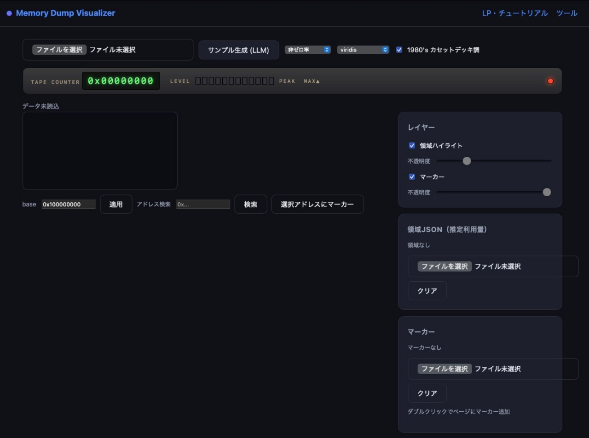

<!-- badges -->
[](LICENSE)
[](https://d3js.org)
[](https://github.com/watanabe3tipapa/dumpdumpdump)
[](https://github.com/watanabe3tipapa/dumpdumpdump/commits/main)
[](https://watanabe3tipapa.github.io/dumpdumpdump/)

[日本語](README.md) | [English](README_en.md)

# Memory Dump Visualizer

macOS のメモリダンプをブラウザ上で視覚的に掌握するための軽量 Web ツール。
Canvas + D3.js によるヒートマップ可視化と、領域ハイライト / マーカーを重ねられる多層表示を備え、GitHub Pages で公開しています。

- **Live Demo**: https://watanabe3tipapa.github.io/dumpdumpdump/
- **ツール本体**: https://watanabe3tipapa.github.io/dumpdumpdump/viewer.html

## Motivation

**バックエンドで稼働している LLM / AI プロセスのメモリ消費を洗い出す**ために作りました。
llama-server / ollama / python(torch) などの推論プロセスは、OS から見るとひとつの「巨大なメモリ塊」。
どこがモデル重みで、どこが KV キャッシュなのかを従来のツールで直感的に把握するのは難しい。
本ツールはダンプを 4KB ページ単位のヒートマップに変換し、非ゼロ率・エントロピー・文字密度という
切り口で領域を特定しながら、モデル重み / KV キャッシュ / アクティベーション等が
「実際に何 MiB 使っているか」を推定できます。

> 注: 本ツールは *取得後のバイナリを可視化* するものであり、ダンプ取得自体は lldb / vmmap の役割です。

## Features

- **ヒートマップ可視化** — ダンプ全体を 4KB ページのグリッドで一望（Canvas 描画）
- **指標の切替** — 非ゼロ率 / エントロピー / 文字密度
- **多層表示** — 領域ハイライトとマーカーを JSON で重ね、各層の表示 / 不透明度を調整
- **推定利用量** — 各領域が何 MiB 使っているかを自動集計
- **1980's カセットデッキ調** — VU メーター風の LED セグメント / テープカウンタ / ピークホールド
- **軽量** — 依存は D3.js の CDN 1 本のみ、ビルド不要 / npm 不要。計算は Web Worker で実行
- **hex/ASCII インスペクタ** — クリックしたページのバイト列を検査、アドレス検索でジャンプ

## Screenshot



## Installation (ローカル)

```bash
git clone https://github.com/watanabe3tipapa/dumpdumpdump.git
cd dumpdumpdump
python3 -m http.server 8000   # → http://localhost:8000

# テスト実行（Node のみ・依存なし）
node tests/run-tests.mjs
```

## Usage

1. ブラウザで `viewer.html` を開く（公開: `/dumpdumpdump/viewer.html`）
2. バイナリダンプ（`dump.bin`）をアップロード、または「サンプル生成」で LLM プロセス想定のデモデータを作成
3. ホバーでページ情報 / クリックで hex・ASCII を検査、アドレス検索で該当ページへジャンプ
4. 「領域JSON読込」「マーカーJSON読込」で解析レイヤーを重ねる
5. 「1980's カセットデッキ調」で VU メーター風の見た目にも切替可能

### ダンプ取得（macOS）

```bash
# 対象の LLM / AI プロセスを確認
ps aux | grep -Ei 'llama|ollama|python|torch'

# メモリ領域レイアウトを確認
vmmap <PID>

# lldb でバイナリを取得（例: 0x100000000 から 0x4000000 バイト）
sudo lldb -p <PID> \
  -o "memory read --force --binary --outfile dump.bin 0x100000000 0x140000000" \
  -o detach -o quit

# ヘルパースクリプト（バイナリ + regions.json を一度に生成）
sudo ./scripts/acquire_dump.sh -p <PID> -a 0x100000000 -s 0x4000000 \
  -o dump.bin -j regions.json
```

## Documentation

詳細は [DEV-MEMO.md](DEV-MEMO.md)（設計・仕様・作業ログ）を参照してください。
LP / チュートリアルは https://watanabe3tipapa.github.io/dumpdumpdump/ で公開中です。

## Contributing

歓迎します！

1. Fork する
2. フィーチャーブランチを作成する（`git checkout -b feature/amazing-feature`）
3. 変更をコミットする（`git commit -m 'Add amazing feature'`）
4. ブランチへ push する（`git push origin feature/amazing-feature`）
5. [Pull Request](https://github.com/watanabe3tipapa/dumpdumpdump/pulls) を開く

## License

MIT License — [LICENSE](LICENSE) を参照してください。

## Contact

GitHub: [https://github.com/watanabe3tipapa/dumpdumpdump](https://github.com/watanabe3tipapa/dumpdumpdump)